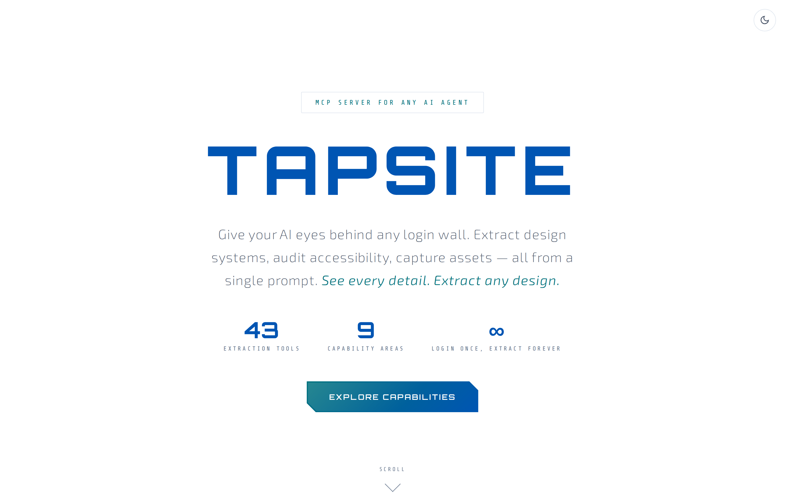
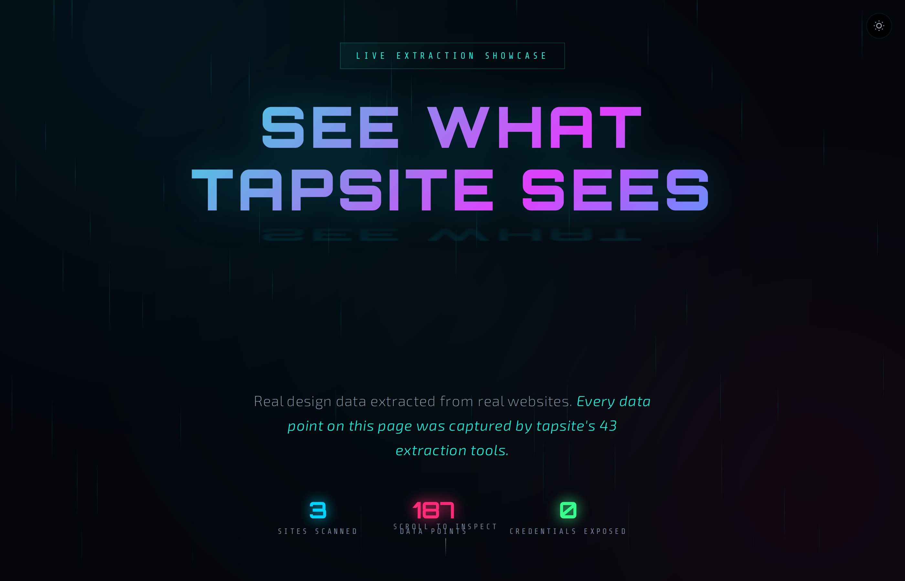
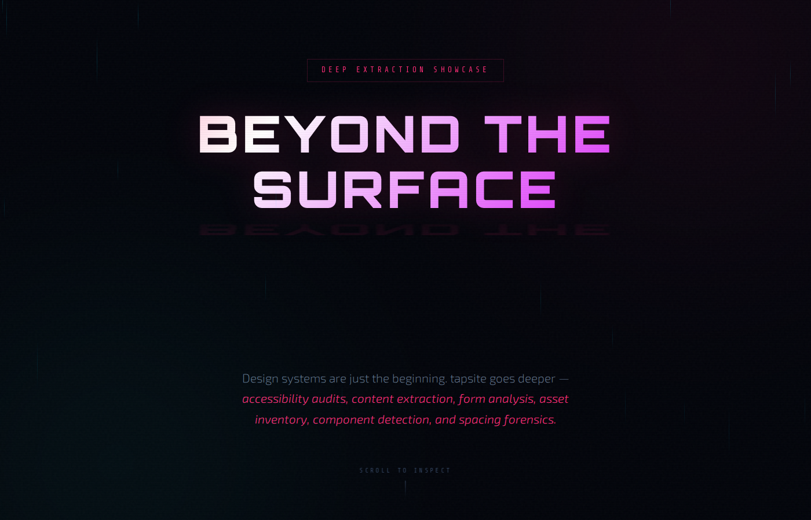
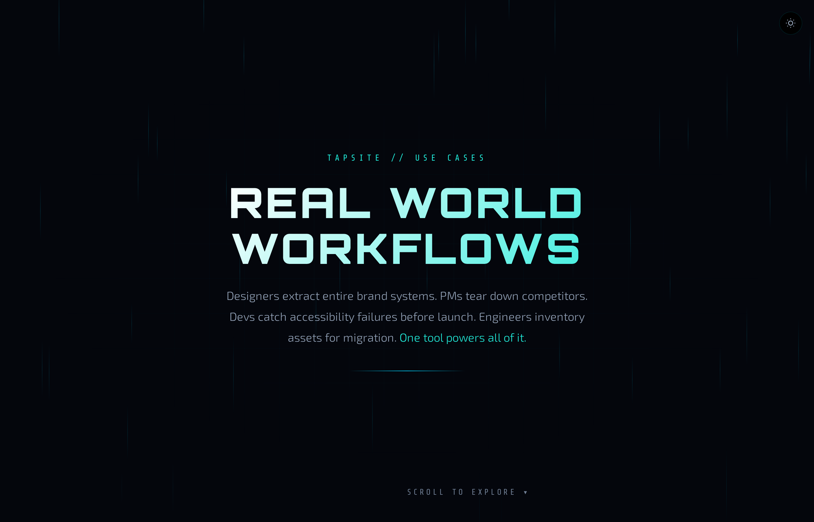

# tapsite

Design intelligence toolkit — an MCP server + CLI for extracting design systems, auditing accessibility, and analyzing any website. Works with Claude, Cursor, Windsurf, and any MCP-compatible AI agent. Login once to MFA-protected sites and extract forever — sessions persist across tool calls.

## Installation

```bash
# Quick start (no install required)
npx tapsite

# Or install globally
npm install -g tapsite
npx playwright install chromium
npx playwright install-deps chromium
```

Add to your Claude config (`~/.claude/mcp.json`):

```json
{
  "mcpServers": {
    "tapsite": {
      "command": "npx",
      "args": ["tapsite"]
    }
  }
}
```

> **First run:** Playwright will install the Chromium browser automatically if not already present. This is a one-time ~150MB download.

## Showcase

Click any image to see the full interactive page:

[](https://mgriffen.github.io/tapsite/product.html)

**43 extraction tools** for web design analysis — colors, fonts, performance, accessibility, content, forms, assets, and more. Works with any MCP-compatible AI agent.

| Design System Extraction | Deep Intelligence |
|:---:|:---:|
| [](https://mgriffen.github.io/tapsite/showcase-design.html) | [](https://mgriffen.github.io/tapsite/showcase-deep.html) |
| Live-extracted colors, fonts, perf, breakpoints, and animations from Stripe, Linear, and Vercel | Accessibility audits, content extraction, form analysis, asset inventory, component detection |

[](https://mgriffen.github.io/tapsite/scenarios.html)

**Four real-world workflows** — design system extraction, competitive research, accessibility auditing, and asset migration prep.

## Development setup (from source)

```bash
git clone https://github.com/mgriffen/tapsite
cd tapsite
npm install
npx playwright install chromium
npx playwright install-deps chromium
```

MCP config pointing to local source:

```json
{
  "mcpServers": {
    "tapsite": {
      "command": "node",
      "args": ["/absolute/path/to/tapsite/src/server.js"]
    }
  }
}
```

Recommended — set transcript cleanup to prevent credentials lingering on disk:

```json
"cleanupPeriodDays": 1
```

## Docker

tapsite ships a `Dockerfile` and `docker-compose.yml` for headless-only use — CI pipelines, server deployments, or anywhere you don't want a local Node.js install.

### Quick start

```bash
# Build the image
docker build -t tapsite .

# Run (stdio-attached, extraction results saved to ./output)
docker compose up
```

Extraction results from all `tapsite_export*` tools are written to `./output` on your host via the volume mount in `docker-compose.yml`.

### Limitations in Docker

**`tapsite_login_manual` is not available in Docker.** It opens a headed (visible) browser window, which requires a display. Standard containers are headless-only.

### Authenticated sessions in Docker

If you need to extract from a site that requires login:

1. **Run tapsite locally** (outside Docker):
   ```bash
   # In Claude, call:
   tapsite_login_manual   # opens headed Chromium, log in + complete MFA manually
   tapsite_login_check    # confirm session is authenticated
   ```

2. **Copy your `profiles/` directory into the project root.** The session cookies are stored there.

3. **Mount `profiles/` in docker-compose.yml** (uncomment the line):
   ```yaml
   volumes:
     - ./output:/app/output
     - ./profiles:/app/profiles   # ← uncomment this
   ```

4. **Run the container.** It picks up the saved session automatically. No login needed.

> **Security note:** `profiles/` contains live session cookies. Treat it like a password — don't commit it to version control (it's already in `.gitignore`), and restrict access to the volume on shared systems.

## Tools (43)

### Session
| Tool | Description |
|------|-------------|
| `tapsite_login` | Automated login (username + password, no MFA) |
| `tapsite_login_manual` | Open headed browser for manual login + MFA |
| `tapsite_login_check` | Verify authenticated session state |
| `tapsite_inspect` | Navigate to URL and perform full DOM inspection (nav, headings, buttons, forms, tables, links) |
| `tapsite_screenshot` | Take a screenshot of the current page |
| `tapsite_interact` | Click or fill an indexed element from the last inspect |
| `tapsite_scroll` | Scroll the page |
| `tapsite_run_js` | Execute arbitrary JavaScript and return the result |
| `tapsite_close` | Close the browser session |

### Content Extraction
| Tool | Description |
|------|-------------|
| `tapsite_extract_table` | Extract a specific table as structured data |
| `tapsite_extract_links` | Extract all links with text and href |
| `tapsite_extract_metadata` | Extract page metadata (title, description, OG tags, etc.) |
| `tapsite_extract_content` | Extract main readable content (article body, headings, paragraphs) |
| `tapsite_extract_forms` | Extract all forms with fields, labels, and actions |

### Design Tokens
| Tool | Description |
|------|-------------|
| `tapsite_extract_colors` | Extract color palette (hex values + usage counts) |
| `tapsite_extract_fonts` | Extract font families, sizes, weights |
| `tapsite_extract_css_vars` | Extract CSS custom properties |
| `tapsite_extract_spacing` | Extract spacing scale values |
| `tapsite_extract_shadows` | Extract box-shadow and text-shadow patterns |

### Visual Assets
| Tool | Description |
|------|-------------|
| `tapsite_extract_images` | Extract all images with src, alt, dimensions |
| `tapsite_download_images` | Download images to local output directory |
| `tapsite_extract_svgs` | Extract inline SVGs |
| `tapsite_extract_favicon` | Extract favicon URLs and sizes |

### Layout Intelligence
| Tool | Description |
|------|-------------|
| `tapsite_extract_layout` | Extract layout tree (inline text representation) |
| `tapsite_extract_components` | Detect repeated UI components and patterns |
| `tapsite_extract_breakpoints` | Extract responsive breakpoints from CSS media queries |

### Network Intelligence
| Tool | Description |
|------|-------------|
| `tapsite_capture_network` | Capture network requests during a page load |
| `tapsite_extract_api_schema` | Infer API schema from observed network traffic |
| `tapsite_extract_stack` | Detect frontend framework, libraries, and tech stack |

### Multi-page
| Tool | Description |
|------|-------------|
| `tapsite_crawl` | Crawl multiple pages from a start URL |
| `tapsite_diff_pages` | Compare two pages and report differences |

### Advanced
| Tool | Description |
|------|-------------|
| `tapsite_extract_animations` | Extract CSS animations and transitions |
| `tapsite_extract_a11y` | Accessibility audit (ARIA, roles, contrast issues) |
| `tapsite_extract_darkmode` | Detect dark mode support and extract dark palette |
| `tapsite_extract_perf` | Extract performance metrics (Core Web Vitals, resource sizes) |
| `tapsite_extract_icons` | Detect icon libraries and extract icon usage |
| `tapsite_extract_contrast` | Audit WCAG contrast ratios between text and background |

### Export
| Tool | Description |
|------|-------------|
| `tapsite_export` | Export inspection results as JSON + Markdown + HTML report + CSV tables + screenshots |
| `tapsite_export_design_report` | Full design system report: `report.html` (visual), `design-tokens.json` (W3C format), `design-tokens.css` (copy-pasteable `:root` vars) |

### Workflows (Presets)
| Tool | Description |
|------|-------------|
| `tapsite_teardown` | Comprehensive competitive design teardown (all extractors) |
| `tapsite_audit` | Pre-launch quality audit (a11y, contrast, perf, SEO, darkmode) |
| `tapsite_harvest` | inventory all site assets (images, SVGs, forms, fonts, links) |
| `tapsite_designsystem` | Extract design tokens as W3C JSON and CSS variables |

## Security

### Prompt injection defense

When extracting content from untrusted web pages, tapsite applies two layers of protection:

1. **Hidden element filtering** — Extractors skip elements with `display:none`, `visibility:hidden`, `opacity:0`, zero-size, and clip-hidden styling. This prevents invisible text (a common prompt injection vector) from entering extraction results. Applied to content, links, forms, and accessibility extractors.

2. **Output sanitization** — All text returned to the LLM is scanned for prompt injection patterns: instruction overrides, role hijacking, exfiltration attempts, and tool manipulation. Matches are flagged inline as `[INJECTION_DETECTED]` rather than silently dropped, so both the LLM and user can see what was caught.

### Credential safety

**Never pass credentials through the chat.** Use `tapsite_login_manual` to open a headed browser, log in manually (including MFA), then `tapsite_login_check` to confirm. Credentials never touch Anthropic's servers or local transcripts.

## License

MIT

## Project structure

```
src/
  server.js        — MCP server entry point
  browser.js       — shared Chromium context (ensureBrowser, closeBrowser)
  helpers.js       — shared helpers (navigateIfNeeded, summarizeResult, indexPage)
  sanitizer.js     — prompt injection detection
  extractors.js    — browser-context extraction functions (page.evaluate())
  exporter.js      — file export: JSON, Markdown, HTML, CSV
  inspector.js     — DOM extraction for inspect/navigate tools
  cli.js           — standalone CLI (login, inspect, session)
  config.js        — paths and defaults
  tools/
    session.js     — login, navigate, inspect, screenshot, act, scroll, run_js, close
    extraction.js  — all extract_* and detect_* tools
    network.js     — capture_network, extract_api_schema, detect_stack
    multipage.js   — crawl, diff_pages
    export.js      — export, export_design_report
profiles/          — browser state / session cookies (gitignored)
output/            — export results (gitignored)
```

## Output formats

- `output/run-{timestamp}/` — `tapsite_export` runs: JSON, Markdown, HTML, screenshots, CSV tables
- `output/design-report-{timestamp}/` — `tapsite_export_design_report` runs: `report.html`, `design-tokens.json`, `design-tokens.css`
